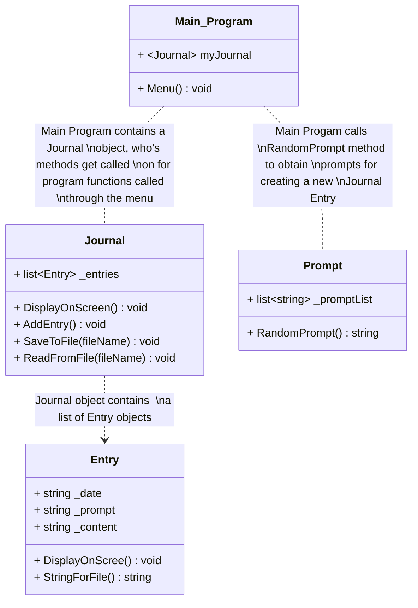

# Journal class diagram

```mermaid
classDiagram
class Main_Program {
 + ~Journal~ myJournal
 + Menu() void
}

class Journal {
 + list~Entry~ _entries
 + DisplayOnScreen() void
 + AddEntry() void
 + SaveToFile(fileName) void
 + ReadFromFile(fileName) void
}

class Entry {
 + string _date
 + string _prompt
 + string _content
 + DisplayOnScree() void
 + StringForFile() string
}

class Prompt {
 + list~string~ _promptList
 + RandomPrompt() string
}

Main_Program .. Journal : Main Program contains a Journal \nobject, who's methods get called \non for program functions called \nthrough the menu

Main_Program .. Prompt : Main Progam calls \nRandomPrompt method to obtain \nprompts for creating a new \nJournal Entry

Journal ..> Entry : Journal object contains  \na list of Entry objects

```
