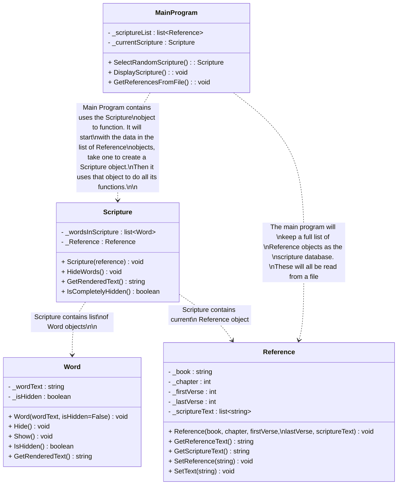

# Class Diagram

## Scripture Memorization program

Class diagram showing the classes to be implemented when making the Scripture Memorization program.

```mermaid
classDiagram
class MainProgram{
 - _scriptureList : list~Reference~
 - _currentScripture : Scripture
 + SelectRandomScripture() : Scripture
 + DisplayScripture() : void 
 + GetReferencesFromFile() : void
}
class Scripture {
 - _wordsInScripture : list~Word~
 - _Reference : Reference
 + Scripture(reference) void
 + HideWords() void
 + GetRenderedText() string
 + IsCompletelyHidden() boolean
}
class Word {
 - _wordText : string
 - _isHidden : boolean
 + Word(wordText, isHidden=False) void
 + Hide() void
 + Show() void
 + IsHidden() boolean
 + GetRenderedText() string
}

class Reference {
 - _book : string
 - _chapter : int
 - _firstVerse : int
 - _lastVerse : int
 - _scriptureText : list~string~
 + Reference(book, chapter, firstVerse,\nlastVerse, scriptureText) void
 + GetReferenceText() string
 + GetScriptureText() string
 + SetReference(string) void
 + SetText(string) void
}

 MainProgram ..> Scripture : Main Program contains uses the Scripture\nobject to function. It will start\nwith the data in the list of Reference\nobjects, take one to create a Scripture object.\nThen it uses that object to do all its functions.\n\n  
Scripture ..> Word : Scripture contains list\nof Word objects\n\n
Scripture ..> Reference : Scripture contains current\n Reference object
MainProgram ..> Reference : The main program will \nkeep a full list of \nReference objects as the \nscripture database. \nThese will all be read from a file
```
