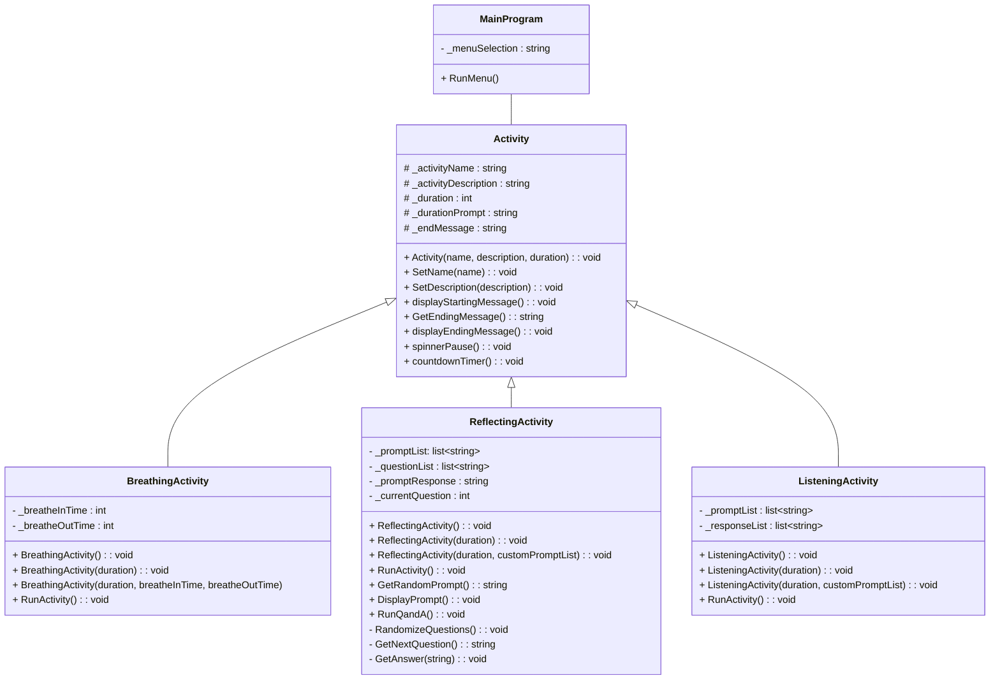

# Mindfulness program

## Class Diagram

```mermaid
classDiagram 
direction TB
class MainProgram{
 - _menuSelection : string
 + RunMenu()
}

class Activity {
 # _activityName : string
 # _activityDescription : string
 # _duration : int
 # _durationPrompt : string
 # _endMessage : string
 + Activity(name, description, duration) : void
 + SetName(name) : void
 + SetDescription(description) : void
 + displayStartingMessage() : void
 + GetEndingMessage() : string
 + displayEndingMessage() : void
 + spinnerPause() : void
 + countdownTimer() : void
}

class BreathingActivity {
 - _breatheInTime : int
 - _breatheOutTime : int
 + BreathingActivity() : void
 + BreathingActivity(duration) : void
 + BreathingActivity(duration, breatheInTime, breatheOutTime)
 + RunActivity() : void
}

class ReflectingActivity {
 - _promptList: list~string~
 - _questionList : list~string~
 - _promptResponse : string
 - _currentQuestion : int
 + ReflectingActivity() : void
 + ReflectingActivity(duration) : void
 + ReflectingActivity(duration, customPromptList) : void
 + RunActivity() : void
 + GetRandomPrompt() : string
 + DisplayPrompt() : void
 + RunQandA() : void
 - RandomizeQuestions() : void
 - GetNextQuestion() : string
 - GetAnswer(string) : void
}

class ListeningActivity {
 - _promptList : list~string~
 - _responseList : list~string~
 + ListeningActivity() : void
 + ListeningActivity(duration) : void
 + ListeningActivity(duration, customPromptList) : void
 + RunActivity() : void
}

MainProgram -- Activity
Activity <|-- BreathingActivity
Activity <|-- ReflectingActivity
Activity <|-- ListeningActivity

```
